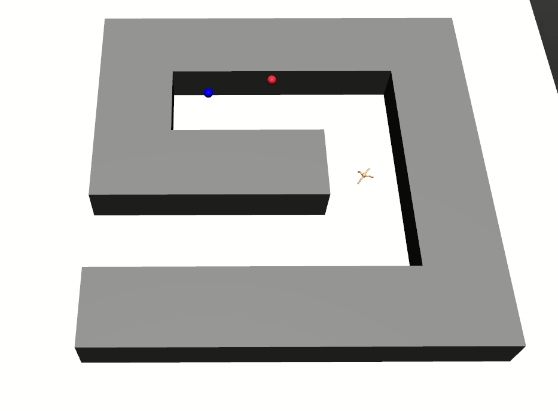

# Implementation of HIRO: Data-Efficient Hierarchical Reinforcement Learning
This repository implements the HIRO algorithm for Hierarchical Reinforcement Learning on the original AntMaze environment as presented by Ofir Nachum (Data-Efficient Hierarchical Reinforcement Learning, 2018) 

## Dependencies 
- gym==0.16.0
- mujoco-py==1.50.1.68
- tensorflow==2.0
- wandb==0.8.29
- omegaconf==1.4.1
- numpy==1.18.1

 ## Usage
```shell
$ python3 main.py ant_config
```
This loads the settings in the experiments/ant_config.yaml which trains the agent for 1.5 millions steps. Every 20000 timesteps,
10 evaluative episodes are played where exploratory noise is turned off. The performance of the agent is recorded and the model 
parameters are saved. Run:
```shell
$ python3 main.py ant_render
```
to then load that model and render the environment.
I use OmegaConf to load different configurations. The default settings are kept in configs/ant_default while configs for specific
experiments are saved in experiments/. 
I use the wandb framework to save and analyse data from different runs.


